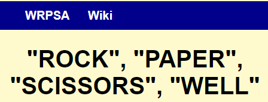
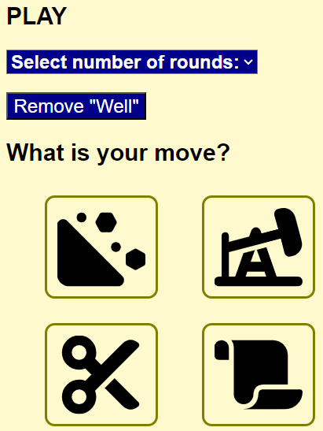

# "Rock", "Paper", "Scissors", "Well"

## Introduction and Rules

This little game is an attempt to extend the traditional "Rock", "Paper", "Scissors" game. It is assumed that the user is familiar with this basic version of the game. Featured in *The Big Bang Theory* featured is the five-weapon variaty of the game (by adding "Lizard" and "Spock"). Here you can play the French version called "Rock", "Paper", "Scissors", "Well" ("Pierre", "Papier", "Ciseaux", "Puit" *in French*). The new winning layout is shown below and is explained in the RULES section.

In this version, two elements ("Well" and "Paper") win against two weapons. This adds a strategical (biased) level to othewise random game. If you miss your good old "Rock", "Paper", "Scissors" game, you can play it by removing the "Well" and using three other weapons you get used to. It is not recommeded though to use this option during the game. You play with your pc and replies are generated randomly. You can play Best-out-of-three, five and ten. **The RULES section is Expandible/Collapsible to get the rules out of your way when you play**.

## Other features

### Header

In the header shows the title of the project and the top navbar where you will find external kinks to the WRPSA (World Rock Paper Scissors Association) and an article on Wikipedia if you wand to learn more about different variants of the game.

### Play area
In the main body of the page, after the RULES, goes the play area. Here you can select the number of rounds you want to play from the drop-down menu. **This is the required field**. The page will issue the warning message if you do not select anything. During the game you cannot make any changes here. You can remove "Well" by clicking the corresponding button if you want to play a traditional "Rock", "Paper", "Scissors" game. See what you prefer.

Finally, the Play area is where you make your move (and check if you are lucky today). The icons will be highlighted when you hover your pointer over.

### Reply area

The reply area is located just below the play area. This is where the computer shows its reply to your bet. It also shows the number of rounds you have already played. For the "Well" gesture I adopted an "oil-well" icon from the Fontawesome collection.

### Results

At the bottom of the page you will find the Results (Score) area. It contains the live results log. You can either collapse of expand it. The log will be updated and the new entry added each time you make a move. Then you can see a counts of wins losses and draws during that game. The numbers are being updated as you play. The *TOTAL* field will indicate the final outcome of the game.

At the bottom of the page (bottom-right corner) there is a reset button. You will lose your score if you activate it during the game. The footer shows the name of the author of the code.

## Used technologies

In this project, HTML, CSS and JavaScript technologies were used.

## Interactivity

The header of the project will be reformatted to accommodate smaller screen.

## Testing

The site was developed and tested using Chrome OS. It was also tested using MS edge. No issues e.g. broken links or console logged errors were discovered.

## Bugs

All bugs were discovered and fixed prior to submission of the project. No unfixed bugs were discovered later.

## Validation

The html and css codes passed W3C and Jigsaw validators with no residual/unresolved issues or warnings. JavaScript code was checked using JSHint (https://jshint.com/) and Esprima (https://esprima.org/index.html) with no issues reported. Lighthouse tool came out with high scores for acessibility (97%), best practices (100%), SEO (80%) and medium performance (57 %).

## Development and deploiment

The code was written and edited using the desktop version of VS Code. The repository was created on GitHub and cloned for desktop GitHub. The project was deployed on GitHub Pages. To deploy the project, the following stest were needed: in GitHub navigate to the Settings tab, from the Sourse section menu select Master Branch, see provided url link.

## "Nice to have" features

It would be interesting to implement statistical analysis to process game results. For example, introduding "well" makes the game less statistical and more strategical. Increasing the number of rounds in a game will decrease the role of pure luck in you results.

## Credits

The icons were taken from https://fontawesome.com/. The picture used was taken from the https://wrpsa.com/about/ (the World Rock Paper Scissors Association). In writing code, <https://www.w3schools.com/>, <https://developer.mozilla.org/en-US/> and <https://stackoverflow.com/> sourses were used. Ultimately, I am grateful immensely to my beloved wife for her support and encouragement.

 